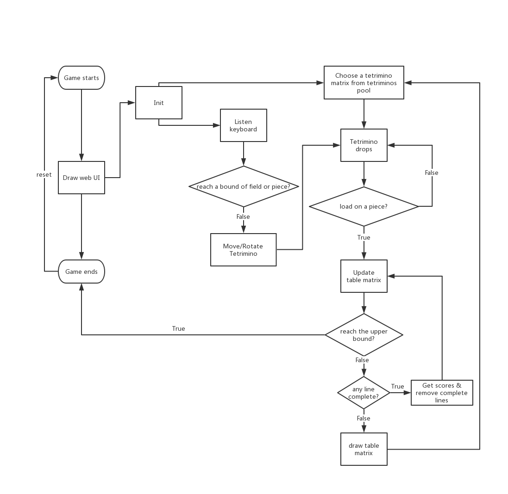

# Tetris
Tetris game with shiny app in R

## Installation
```r
devtools::install_github("https://github.com/TingtHou/Tetris.git")
```
## Usage
```r
launchGame()
```
Use "A"/"D" to move tetrimino

Use "W" rotate tetrimino

## The folder structure
```r
- Tetris 
  |- inst 
    |- shinyapp 
         |- ui.R
         |- server.R
  |- R
     |- shiny.R
     |- TableID.R
     |- GameAction.R 
     |- TableAction.R 
     |- TetrominoAction.R 
  |- DESCRIPTION 
  |- ... 
```
## Program process:

